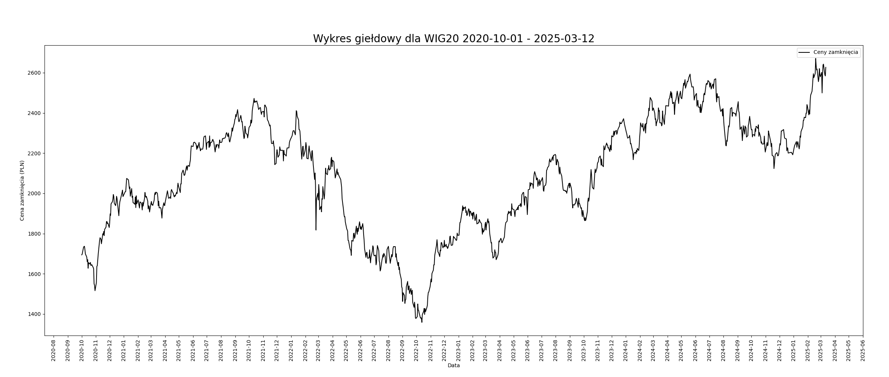

Marta Kociszewska 198143   
### **1. Wstęp**  
  
Wskaźnik **MACD** (skrót od ang. _Moving Average Convergence/Divergence_), czyli konwergencja i dywergencja średnich kroczących, jest jednym z najczęściej stosowanych narzędzi analizy technicznej na rynkach finansowych. Jego głównym celem jest identyfikacja trendów rynkowych oraz generowanie sygnałów kupna i sprzedaży poprzez analizę relacji między dwiema średnimi kroczącymi cen zamknięcia.

MACD opiera się na różnicy pomiędzy krótkoterminową i długoterminową wykładniczą średnią kroczącą (EMA). Standardowe ustawienia obejmują **12-okresową EMA** oraz **26-okresową EMA**, których różnica tworzy tzw. **linię MACD**. Dodatkowo obliczana jest **9-okresowa EMA linii MACD**, zwana **linią sygnałową**, która pomaga w identyfikacji punktów zwrotnych na rynku.

Główną zaletą MACD jest jego zdolność do wykrywania momentów, w których dynamika cen zyskuje na sile lub słabnie, co może sygnalizować odwrócenie trendu. Analiza przecięć linii MACD i linii sygnałowej, a także histogramu MACD, umożliwia określenie potencjalnych punktów wejścia i wyjścia z rynku. Wskaźnik ten jest powszechnie stosowany zarówno w analizie akcji, walut, surowców, jak i kryptowalut, dzięki swojej uniwersalności i łatwości interpretacji.
  
----  
### **2. Dane testowe**  
  
Dane, które zostały wykorzystane w analizie, pochodzą z historycznych notowań indeksu WIG20, obejmujących około 1100 notowań w okresie od 2020-10-01 do 2025-03-12. Indeks WIG20 jest jednym z najważniejszych wskaźników giełdowych w Polsce, reprezentującym 20 największych i najbardziej płynnych spółek na warszawskiej giełdzie. Dane obejmują zmiany cen zamknięcia, wartości indeksu oraz inne istotne parametry, takie jak wolumen obrotu i zmienność rynkowa, które mogą być wykorzystane do analizy trendów rynkowych, badania zmienności, czy też testowania różnych strategii inwestycyjnych.   
  
Obliczenia będą oparte na datach i cenach zamknięcia.  
  
Tabela zawiera przykładowe dane notowań indeksu WIG20.  
  
| Data       | Otwarcie | Najwyzszy | Najnizszy | Zamkniecie | Wolumen  |
| ---------- | -------- | --------- | --------- | ---------- | -------- |
| 2020-10-01 | 1719.55  | 1723.85   | 1697.54   | 1694.18    | 22310007 |
| 2020-10-02 | 1690.04  | 1704.58   | 1675.2    | 1697.39    | 18298699 |
  
Dane zostały pobrane z serwisu *stooq.pl*, który oferuje darmowy dostęp do historycznych notowań giełdowych, indeksów, walut, czy towarów.  
  
Wykres 2.1 przedstawia zmiany cen zamknięcia w okresie od 2020-10-01 do 2025-03-12.  
  
  
<small>Wykres 2.1</small>  

----
### **3. Konstrukcja i analiza wskaźnika MACD**  
  
Wskaźnik MACD obliczany przy użyciu wykładniczej średniej kroczącej **EMA** (skrót od ang. *Exponentail Moving Avarage*) obliczanej według wzoru:  
$$ EMA_N(i) = \alpha \cdot x_i + (1-\alpha) \cdot EMA_N(i - 1)  
\tag{1}$$  
gdzie:   
- $x_i$ - cena zamknięcia w $i$-tym okresie  
- $N$ - liczba okresów  
- $\alpha$ - współczynnik wygładzający: $\alpha = \frac{2}{N+1}$  
  
Równanie $(1)$ można przekształcić do postaci jawnej:  
$$  
EMA_N(i) =   
\frac  
{x_1 + (1-\alpha)x_{i-1} + (1-\alpha)^2 x_{i-2} + ... + (1-\alpha)^N x_{i-N}}  
{1+ (1 - \alpha) + (1 - \alpha)^2 + ... + (1 - \alpha)^N}  
\tag{2}  
$$  
Jest to forma średniej ważonej, w której wagi dla wcześniejszych cen zmniejszają się w sposób wykładniczy. Tego rodzaju średnia szybciej reaguje na zmiany cen aktywa, uwzględniając jednocześnie wszystkie wcześniejsze ceny, przy jednoczesnym stopniowym osłabianiu ich wpływu.  
  
Z obu przedstawionych równań wynika, że wartość **EMA** dla $i$-tego okresu zależy zarówno od bieżącej ceny zamknięcia $x_i$ jak i od wszystkich wcześniejszych cen. W obliczeniach **EMA** pojawia się problem ustalenia wartości początkowej. Z równania (2) wynika, że 26-dniową EMA można obliczyć już po drugiej cenie, co nie odpowiada intuicyjnemu rozumieniu średniej 26-dniowej, ponieważ pomija pierwsze dni. Przy założeniu, że $EMA_N(0)=x_0$ obliczenia mogą prowadzić do oscylacji, które źle odwzorowują zmienność cen. Aby poprawić dokładność początkowych wartości, obliczenia zaczyna się od $i=N+1$, gdzie wartość $EMA_N(N)$ to średnia z pierwszych $N$ cen. Należy zaznaczyć, że bez względu na metodę, wyniki **EMA** dla kolejnych okresów będą zbieżne, a stabilizacja następuje zazwyczaj po $N$-tym, choć preferowane jest $2N$-tym okresie.  
##### **Krzywa MACD**  
Krzywa **MACD** wyznaczana jest przez różnicę między szybką a wolną średnią kroczącą. W popularnym podejściu średnie przyjmują wartość:  
- $EMA_{12}$ - 12-okresowa wykładnicza średnia krocząca,  
- $EMA{26}$ - 26-okresowa wykładnicza średnia krocząca.  
  
Wówczas krzywą **MACD** można obliczyć według wzoru:  
$$  
MACD = EMA_{12} - EMA_{26}  
\tag{3}  
$$  
  
##### **Krzywa SIGNAL**  
W wyżej wspomnianym podejściu krzywa **SIGNAL** wyznaczana jest jako 9-okresowa wykładnicza średnia krocząca obliczana na podstawie wartości **MACD**.  
  
Krzywą można obliczyć według wzoru:  
$$  
SIGNAL = EMA_9 (MACD)  
\tag{4}  
$$  
  ----
### **4. Interpretacja wskaźnika MACD**  
  
Wskaźnik **MACD** jest używany do identyfikacji trendów rynkowych, sygnałów kupna i sprzedaży oraz do analizy zmienności cen. Podstawowe zasady interpretacji wskaźnika **MACD**:  
- **Krzywa MACD** powyżej zera - sygnał wzrostowy, poniżej zera - sygnał spadkowy,  
- **Krzywa SIGNAL** przecina **MACD** od dołu - sygnał kupna, od góry - sygnał sprzedaży,  
- **Krzywa MACD** i **SIGNAL** powyżej zera - sygnał wzrostowy, poniżej zera - sygnał spadkowy,  
  
Warto zaznaczyć, że wskaźnik **MACD** nie jest wskaźnikiem samym w sobie, ale jedynie narzędziem, które należy interpretować w kontekście innych wskaźników i analizy rynkowej.   
Wskaźnik **MACD** jest jednym z wielu narzędzi analizy technicznej, które mogą być wykorzystane do analizy rynku finansowego.  
  
Wykres 3.1 przedstawia wartości **MACD** oraz **SIGNAL** dla indeksu WIG20 w okresie od 2020-10-01 do 2025-03-12.   
![[macd_and_signal.png]]
<small>Wykres 3.1. Wykres MACD przy użyciu zaimplementowanych funkcji</small>  

Aby zweryfikować poprawność implementacji wskaźnika MACD, do sprawozdania dołączono również wykres 3.2 przedstawiający wykres MACD obliczony przy użyciu oprogramowania *MATLAB*, korzystając z funkcji `macd` pochodzącej z pakietu *Financial Toolbox*. Dzięki temu możliwe jest porównanie wyników obu metod i ocena zgodności uzyskanych rezultatów.

Wykres 3.2 przedstawia wartości **MACD** oraz **SIGNAL**  dla indeksu WIG20 w okresie od 2020-10-01 do 2025-03-12 obliczone przy użyciu *MATLAB* i funkcji `macd`.

![[macd_plot_by_matlab.png]]
<small>Wykres 3.2. Wykres MACD przy użyciu oprogramowania MATLAB</small>

Histogram **MACD** to graficzna reprezentacja różnicy między linią MACD a linią sygnałową. Pokazuje on dynamikę zmian siły trendu oraz momenty, w których może dojść do odwrócenia kierunku cen. Histogram jest obliczany jako:
$$ \text{Histogram MACD = MACD line - SIGNAL line}$$
Gdy wartości histogramu są dodatnie, oznacza to, że linia MACD znajduje się powyżej linii sygnałowej, co może wskazywać na przewagę trendu wzrostowego. Natomiast wartości ujemne sugerują, że linia MACD jest poniżej linii sygnałowej, co może oznaczać trend spadkowy. Wzrosty i spadki słupków histogramu pozwalają również ocenić siłę zmian cen oraz potencjalne punkty odwrócenia trendu.

Wykres 3.3 przedstawia histogram wartości **MACD** oraz **SIGNAL** w okresie od 2020-10-01 do 2020-12-31.  

<small>Wykres 3.3. Histogram</small>  

Wskaźnik **MACD** oraz jego linia sygnałowa są często analizowane poprzez ich wzajemne przecięcia, które dostarczają istotnych informacji na temat możliwych zmian trendu. Analiza tych przecięć pomaga w identyfikacji momentów wejścia i wyjścia z rynku oraz w ocenie siły trendu.

Wykres 3.4 przedstawia wartości **MACD** oraz **SIGNAL** w okresie od 2020-10-01 do 2020-12-31, wraz z zaznaczonymi momentami, w których krzywa **SIGNAL** przecina krzywą **MACD**.  

![[macd_signal_cross_points.png]]
<small>Wykres 3.4</small>  

Gdy **MACD** przecina linię **SIGNAL** od dołu, jest to uznawane za **sygnał kupna**, sugerujący, że trend wzrostowy może nabierać na sile. Natomiast gdy **MACD** przecina linię **SIGNAL** od góry, oznacza to **sygnał sprzedaży**, co może wskazywać na osłabienie trendu wzrostowego i potencjalny ruch spadkowy.

Wskazane są momenty kupna, kiedy krzywa **MACD** przecina krzywą **SIGNAL** od dołu oraz sprzedaży, kiedy krzywa **MACD** przecina krzywą **SIGNAL** od góry.  
Sygnał kupna został oznaczony kolorem zielonym, sygnał sprzedaży - kolorem czerwonym.  

![[macd_signal_buy_sell_signals.png]]
<small>Wykres 3.5</small>  
  
