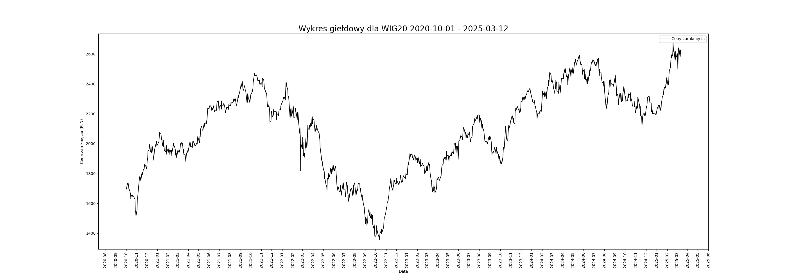

Marta Kociszewska 198143 
### **1. Wstęp**

Wskaźnik **MACD** (skrót od ang. *Moving Average Convergence/Divergence*) dosłownie oznacza to średnią kroczącą konwergencję/dywergencję, to narzędzie analizy technicznej, wykorzystywane do identyfikowania trendów rynkowych i sygnałów kupna lub sprzedaży. Jest jednym z najpopularniejszych narzędzi w analizie technicznej instrumentów finansowych. Polega na obserwacji dynamiki cen - różnicy między średnią krótkoterminową a długoterminową - co pozwala na wykrycie momentów, w których ruch cenowy zyskuje na sile lub spadnie.

----
### **2. Dane testowe**

Dane, które zostały wykorzystane w analizie, pochodzą z historycznych notowań indeksu WIG20, obejmujących około 1100 notowań w okresie od 2020-10-01 do 2025-03-12. Indeks WIG20 jest jednym z najważniejszych wskaźników giełdowych w Polsce, reprezentującym 20 największych i najbardziej płynnych spółek na warszawskiej giełdzie. Dane obejmują zmiany cen zamknięcia, wartości indeksu oraz inne istotne parametry, takie jak wolumen obrotu i zmienność rynkowa, które mogą być wykorzystane do analizy trendów rynkowych, badania zmienności, czy też testowania różnych strategii inwestycyjnych. 

Obliczenia będą oparte na datach i cenach zamknięcia.

Tabela zawiera przykładowe dane notowań indeksu WIG20.

| Data       | Otwarcie | Najwyzszy | Najnizszy | Zamkniecie | Wolumen  |
| ---------- | -------- | --------- | --------- | ---------- | -------- |
| 2020-10-01 | 1719.55  | 1723.85   | 1697.54   | 1694.18    | 22310007 |
| 2020-10-02 | 1690.04  | 1704.58   | 1675.2    | 1697.39    | 18298699 |

Dane zostały pobrane z serwisu stooq.pl, który oferuje darmowy dostęp do historycznych notowań giełdowych, indeksów, walut, czy towarów.

Wykres 2.1 przedstawia zmiany cen zamknięcia w okresie od 2020-10-01 do 2025-03-12.

</img>
<small>Wykres 2.1</small>
------
### **3. Konstrukcja i analiza wskaźnika MACD**

Wskaźnik MACD obliczany przy użyciu wykładniczej średniej kroczącej **EMA** (skrót od ang. *Exponentail Moving Avarage*) obliczanej według wzoru:
$$ EMA_N(i) = \alpha \cdot x_i + (1-\alpha) \cdot EMA_N(i - 1)
\tag{1}$$
gdzie: 
- $x_i$ - cena zamknięcia w $i$-tym okresie
- $N$ - liczba okresów
- $\alpha$ - współczynnik wygładzający: $\alpha = \frac{2}{N+1}$

Równanie $(1)$ można przekształcić do postaci jawnej:
$$
EMA_N(i) = 
\frac
{x_1 + (1-\alpha)x_{i-1} + (1-\alpha)^2 x_{i-2} + ... + (1-\alpha)^N x_{i-N}}
{1+ (1 - \alpha) + (1 - \alpha)^2 + ... + (1 - \alpha)^N}
\tag{2}
$$
Jest to forma średniej ważonej, w której wagi dla wcześniejszych cen zmniejszają się w sposób wykładniczy. Tego rodzaju średnia szybciej reaguje na zmiany cen aktywa, uwzględniając jednocześnie wszystkie wcześniejsze ceny, przy jednoczesnym stopniowym osłabianiu ich wpływu.

Z obu przedstawionych równań wynika, że wartość **EMA** dla $i$-tego okresu zależy zarówno od bieżącej ceny zamknięcia $x_i$ jak i od wszystkich wcześniejszych cen. W obliczeniach **EMA** pojawia się problem ustalenia wartości początkowej. Z równania (2) wynika, że 26-dniową EMA można obliczyć już po drugiej cenie, co nie odpowiada intuicyjnemu rozumieniu średniej 26-dniowej, ponieważ pomija pierwsze dni. Przy założeniu, że $EMA_N(0)=x_0$ obliczenia mogą prowadzić do oscylacji, które źle odwzorowują zmienność cen. Aby poprawić dokładność początkowych wartości, obliczenia zaczyna się od $i=N+1$, gdzie wartość $EMA_N(N)$ to średnia z pierwszych $N$ cen. Należy zaznaczyć, że bez względu na metodę, wyniki **EMA** dla kolejnych okresów będą zbieżne, a stabilizacja następuje zazwyczaj po $N$-tym, choć preferowane jest $2N$-tym okresie.
##### **Krzywa MACD**
Krzywa **MACD** wyznaczana jest przez różnicę między szybką a wolną średnią kroczącą. W popularnym podejściu średnie przyjmują wartość:
- $EMA_{12}$ - 12-okresowa wykładnicza średnia krocząca,
- $EMA{26}$ - 26-okresowa wykładnicza średnia krocząca.

Wówczas krzywą **MACD** można obliczyć według wzoru:
$$
MACD = EMA_{12} - EMA_{26}
\tag{3}
$$

##### **Krzywa SIGNAL**
W wyżej wspomnianym podejściu krzywa **SIGNAL** wyznaczana jest jako 9-okresowa wykładnicza średnia krocząca obliczana na podstawie wartości **MACD**.

Krzywą można obliczyć według wzoru:
$$
SIGNAL = EMA_9 (MACD)
\tag{4}
$$

### **4. Implementacja**
Implementacja wskaźnika **MACD** w języku Python została przeprowadzona przy użyciu biblioteki `pandas` oraz `numpy`. Poniżej przedstawiono kod funkcji, która oblicza wartości **MACD** oraz **SIGNAL** na podstawie danych wejściowych.

Impelemntacja funkcji obliczającej wartość *EMA* - wykładniczej średniej kroczącej:
```python
def calulate_ema(data, N):
    alpha = 2/(N+1)
    EMA = [data[0]]
    for i in range(N, len(data)):
        EMA.append(alpha * data[i] + (1 - alpha) * EMA[-1])
    return EMA
```

Implementacja funkcji obliczających wartość **MACD** oraz **SIGNAL**:
```python
def calculate_macd(data, N1=12, N2=26):
    EMA1 = calulate_ema(data, N1)
    EMA2 = calulate_ema(data, N2)
    MACD = np.array(EMA1) - np.array(EMA2)
    return MACD
```
```python
def calculate_signal(data, N=9):
    return calulate_ema(data, N)
```
